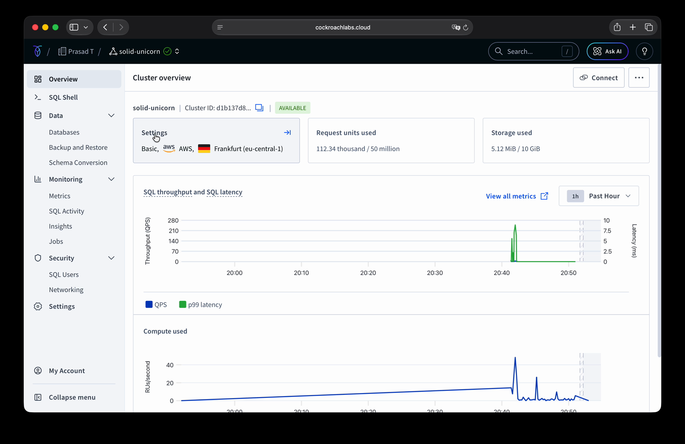
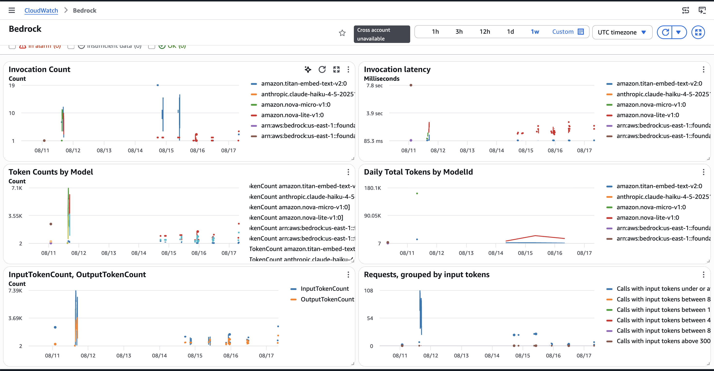

# Proof package — every claim, one receipt

One page for judges. Each row in the submission that says "we used X" links here to the
evidence that we used it — not that X exists. Nothing below is a mock-up: every artifact
is committed in this repo or reproducible against the live cluster and account.

Last verified: 2026-08-16.

---

## CockroachDB tools

### 1. Distributed Vector Indexing — real index, honest planner note

Every house rule is embedded with Titan and stored in a `VECTOR(1024)` column, with a
distributed vector index on it. The answering path does a distance search, pinned to the
epoch's timestamp:

```sql
BEGIN AS OF SYSTEM TIME '<hlc>';
  SELECT id, rule_key, rule_type, statement
  FROM semantic_rules
  WHERE superseded_by IS NULL
  ORDER BY embedding <-> $1        -- $1 = Titan embedding of the question
  LIMIT 5;
COMMIT;
```

`CREATE VECTOR INDEX semantic_embedding_idx ON semantic_rules (embedding)` succeeded
(`vector_l2_ops` in `SHOW CREATE`). The honest part a judge can check — with only five
live rules the planner correctly full-scans rather than using the index:

```
• top-k
│ estimated row count: 5
│ k: 5
└── • filter
    │ filter: (superseded_by IS NULL) AND (embedding IS NOT NULL)
    └── • scan
          estimated row count: 15 (100% of the table)
          table: semantic_rules@semantic_rules_pkey
```

The index is real and the query is a distance search; the corpus is too small for the
planner to prefer it. Stated, not hidden. Full write-up: [`../../eval/RESULTS.md`](../../eval/RESULTS.md).

- Code: [`src/apprentice_crdb/memory.py`](../../src/apprentice_crdb/memory.py) (`recall_similar`, `migrate`)
- Schema: [`sql/001_memory.sql`](../../sql/001_memory.sql)

### 2. ccloud CLI — the official binary, raw output committed

The live Basic cluster was inspected through the official `ccloud` binary, and the raw
JSON is committed so the control-plane claim is verifiable, not asserted:

- **[`ccloud-cli.json`](ccloud-cli.json)** — output of `ccloud cluster list -o json`
- Shows: cluster `solid-unicorn`, **cloud_provider `AWS`**, plan `BASIC`, region
  `eu-central-1`, `cockroach_version v26.2.5`
- Secondary receipt (Cloud API / MCP, same control plane): [`ccloud.txt`](ccloud.txt)

The same cluster in the console — the visual "deployed on AWS" receipt:



Cluster overview: `solid-unicorn`, **AVAILABLE**, **Basic / AWS / Frankfurt
(eu-central-1)**, over a live throughput chart. This is where the rules, vectors, and
timestamps in the demo actually live.

### 3. Cloud Managed MCP Server — dev-side, read-only, boundary stated

Cursor was connected to the live cluster over the managed MCP endpoint to inspect the
`semantic_rules` schema, row counts, and AOST behaviour while building and debugging the
memory layer. The boundary, stated plainly: **the agent does not call MCP at answer
time, and every write goes through the CLI.** The build-session FAQ confirmed
development-side MCP use qualifies. This is the honest limit, not dressed up as runtime
tool use.

---

## AWS services

### 4. Amazon Bedrock — invoked, not just available

The vectors CockroachDB stores are Titan's, and every graded SQL answer is Nova's. Proof
that the models were **invoked**, in three independent forms:

**a. Run manifests** — every education run recorded the model and region it used:

| Arm | `gen_model` | `embedder` | `region` |
|---|---|---|---|
| pre-registered | `amazon.nova-micro-v1:0` | `bedrock-titan` | `us-east-1` |
| replication | `amazon.nova-lite-v1:0` | `bedrock-titan` | `us-east-1` |

Files: [`../../eval/runs-nova-micro/agent_manifest.json`](../../eval/runs-nova-micro/agent_manifest.json) ·
[`../../eval/runs-nova-lite/agent_manifest.json`](../../eval/runs-nova-lite/agent_manifest.json).
Every generated SQL string from both arms is committed under `eval/runs-*/`.

**b. CloudWatch invocation metrics** (us-east-1, AWS/Bedrock namespace, one week):



Invocation Count, Token Counts, InputTokenCount/OutputTokenCount and latency, split by
model, for `amazon.titan-embed-text-v2:0`, `amazon.nova-lite-v1:0` and
`amazon.nova-micro-v1:0`. The spikes on Aug 11–15 are the education runs; Aug 16–17 are
live-demo calls. This is the receipt the model-catalog page never was: it shows the
models were **invoked**, with token accounting, not merely that they exist.

**c. Code** — [`src/apprentice_crdb/generate.py`](../../src/apprentice_crdb/generate.py)
(`bedrock-runtime.converse()`) and
[`src/apprentice_crdb/embeddings.py`](../../src/apprentice_crdb/embeddings.py) (Titan).

### 5. AWS Lambda — the hosted demo runs the whole agent turn

The [hosted demo](https://prasadt1.github.io/apprentice-crdb/) is not static. A Function
URL runs the full turn — Titan embed → `embedding <->` recall against the live cluster →
Converse → execute → grade — so judges operate the real agent.

Live response, captured 2026-08-16 (`q02`, with memory):

```json
{ "verdict": "correct", "rows": [[95000]], "retrieved": 5,
  "model_id": "amazon.nova-lite-v1:0", "source": "live" }
```

Ask the same question with `"mode": "no_memory"` and it returns `20000`, graded `wrong` —
the memory is the only variable.

Guardrails (also the Product-Readiness answer): read-only SQL user, fixed 50-question set
(no free-text prompt surface), per-IP rate limit, daily generation cap, CORS restricted to
the Pages origin, and graceful degradation to the recorded run if the function is
unavailable. Deploy notes: [`lambda/demo_ask/README.md`](../../lambda/demo_ask/README.md).

---

## The methodology claim

The whole finding rests on the exam being frozen **before** the agent it grades. That is
checkable in one command:

```bash
pytest -q && python eval/run_exam.py verify
```

Expect `VERIFY OK` with these sha256s, unchanged since the freeze commit `b043aea`
(2026-08-11):

- `eval/questions.json` → `c644565ac522d483e8e9841af9ec56f36df610e4cd516687aeab50ae69b1d911`
- `eval/labels.json` → `8ce8c1481acd20bd24a344cb5fa4a566774b0261909827839509d84cfc161a91`

Freeze record: [`../../eval/FREEZE.md`](../../eval/FREEZE.md) ·
Protocol: [`../../eval/PROTOCOL.md`](../../eval/PROTOCOL.md).
